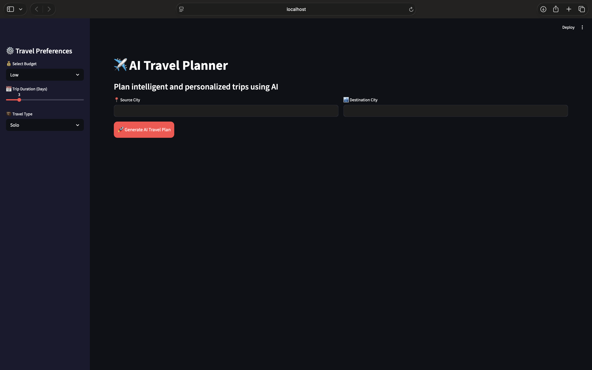
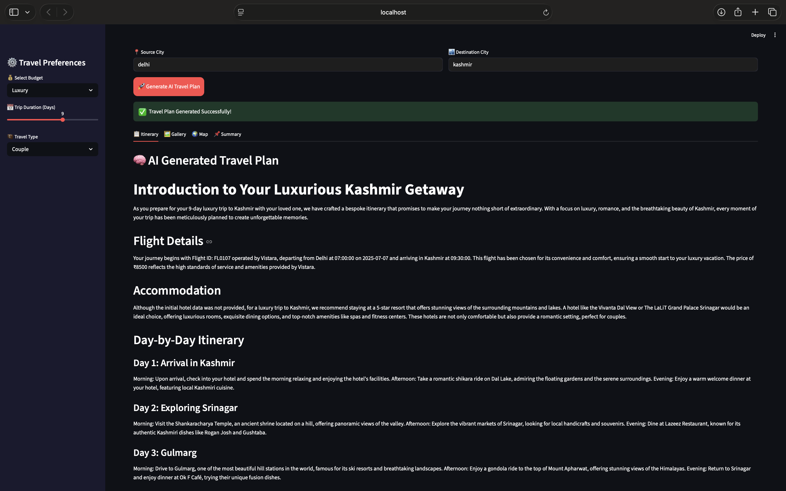
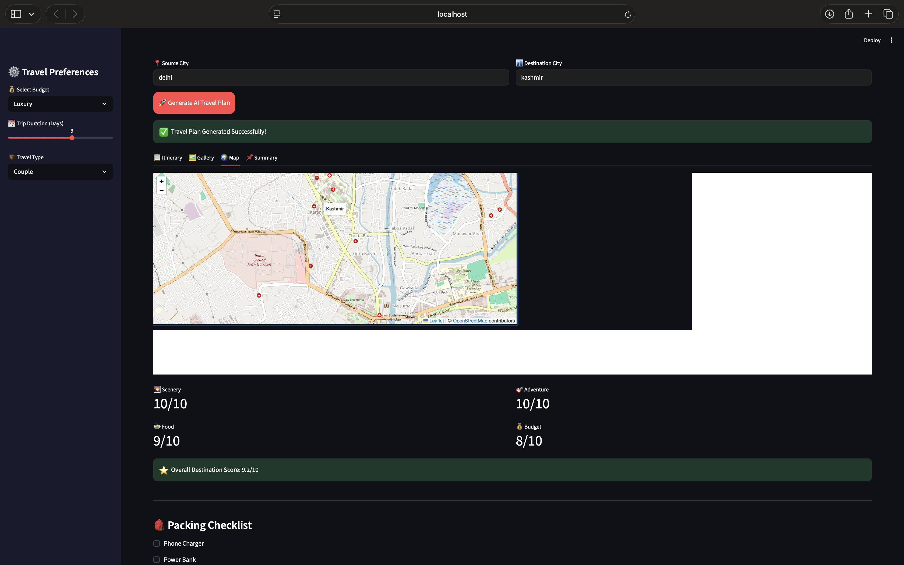
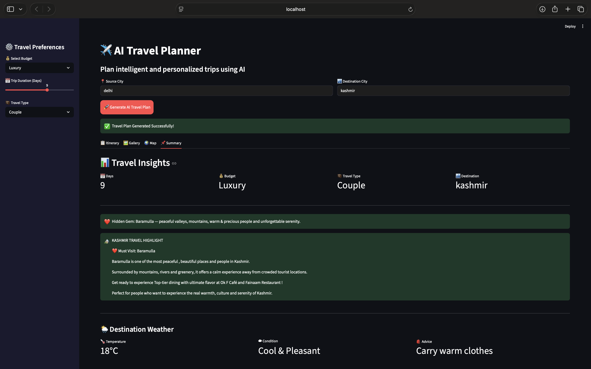

# ✈️ AI Travel Planner

An intelligent travel planning application powered by Artificial Intelligence, built using Python, Streamlit and Groq LLM.

The system generates personalized travel itineraries based on destination, budget, trip duration and travel preferences while providing flight recommendations, hotel suggestions, tourist attractions, food recommendations, weather information and travel insights.

---

🌐 **Live Demo:** [ai-travel-planner-16.streamlit.app](https://ai-travel-planner-16.streamlit.app)

--- 

## 📸 Screenshots

### Home Page

### AI Generated Travel Plan

### Destination Gallery

### Interactive Map

### Travel Dashboard

---

## 🚀 Features

### 🤖 AI-Powered Travel Planning
- Personalized travel itineraries
- Budget-based recommendations
- Travel type based planning
- Detailed day-wise schedules
- Smart destination insights

### ✈️ Flight Recommendations
- Search available flights
- Budget-friendly flight suggestions
- Airline information
- Departure and arrival details

### 🏨 Hotel Recommendations
- Hotel search by destination
- Budget filtering
- Hotel ratings
- Amenities information

### 📍 Tourist Attractions
- Destination-wise attractions
- Hidden gems
- Sightseeing recommendations
- Photography spots

### 🍽️ Food Recommendations
- Local cuisine suggestions
- Famous dishes
- Restaurant recommendations

### 🌦️ Weather Dashboard
- Destination weather information
- Travel advice based on conditions

### 🗺️ Interactive Travel Map
- Destination location visualization
- Interactive map support

### 🖼️ Destination Gallery
- Beautiful destination image galleries
- City-specific images

### 📊 Travel Insights Dashboard
- Budget estimation
- Destination score
- Travel summary
- Trip readiness information

### 🎒 Packing Checklist
- Travel essentials
- Destination-specific recommendations

### 📄 PDF Export
- Download generated travel plans as PDF

### ❤️ Special Kashmir Experience
- Includes a dedicated Baramulla recommendation
- Hidden gem highlights
- Personalized Kashmir travel experiences

---

## 🧠 How It Works

User Inputs
(Source, Destination, Budget, Days, Travel Type)
            ↓
Flight Search Engine
            ↓
Hotel Recommendation Engine
            ↓
Tourist Places Engine
            ↓
Food Recommendation Engine
            ↓
Weather Information
            ↓
Groq AI Itinerary Generation
            ↓
Interactive Dashboard
            ↓
PDF Travel Plan Export

---

## 🛠️ Technologies Used

- Python
- Streamlit
- Groq LLM
- JSON Database
- Folium Maps
- Pandas
- Requests
- FPDF

---

## 📂 Project Structure

AI-TRAVEL-AGENT/

│
├── agent/
│   └── travel_agent.py
│
├── tools/
│   ├── flight_tool.py
│   ├── hotel_tool.py
│   ├── places_tool.py
│   ├── weather_tool.py
│   └── food_tool.py
│
├── data/
│   ├── flights.json
│   ├── hotels.json
│   └── places.json
│
├──images/
│    ├── all destination images
|
│
├── app.py
├── pdf_generator.py
├── requirements.txt
└── README.md

---

## ⚙️ Installation

### Clone Repository

git clone https://github.com/yourusername/ai-travel-planner.git

cd ai-travel-planner

### Create Virtual Environment

python -m venv venv

### Activate Environment

Mac/Linux:

source venv/bin/activate

Windows:

venv\Scripts\activate

### Install Dependencies

pip install -r requirements.txt

---

## 🔑 API Setup

Create a ".env" file:

GROQ_API_KEY=your_groq_api_key

---

## ▶️ Run Application

streamlit run app.py

---

## 🔮 Future Enhancements

- Real-Time Flight APIs
- Real-Time Hotel APIs
- Multi-Language Support
- AI Chat Travel Assistant
- Voice-Based Travel Planning
- User Accounts & Saved Trips
- Travel History Dashboard

---

## 👤 Author

**Name**: ALVIRA PARVEEN  
🔗 [LinkedIn](https://www.linkedin.com/in/alvira-parveen-78022536b)  
🌐 [GitHub](https://github.com/Alvira-Parveen)

---

## 📄 License

This project is licensed under the MIT License — see the [LICENSE](LICENSE) file for details.

---
